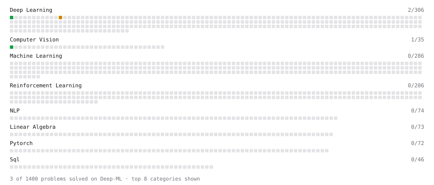

# Deep-ML

My machine learning practice from [Deep-ML](https://www.deep-ml.com). Every solution here was written by hand.

**3** solved · 3 problems · 0 labs · 0 math

[**Browse the interactive portfolio**](https://Ivan-Koptiev.github.io/deep-ml/) to replay this filling in over time.

## Problems

| | Difficulty | Solved | |
| --- | --- | --- | --- |
| [Calculate Image Brightness](https://www.deep-ml.com/problems/70) | easy | 2024-12-30 | [solution](problems/0070-calculate-image-brightness) |
| [Sigmoid Activation Function Understanding](https://www.deep-ml.com/problems/22) | easy | 2024-12-30 | [solution](problems/0022-sigmoid-activation-function-understanding) |
| [Implement Self-Attention Mechanism](https://www.deep-ml.com/problems/53) | medium | 2025-01-04 | [solution](problems/0053-implement-self-attention-mechanism) |

---

_This file is regenerated by Deep-ML on every push._
