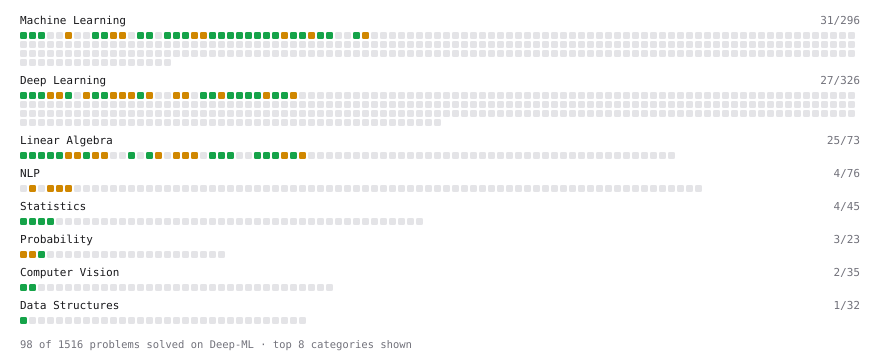

# Deep-ML

My machine learning practice from [Deep-ML](https://www.deep-ml.com). Every solution here was written by hand.

**73** solved · 73 problems · 0 labs · 0 math

[**Browse the interactive portfolio**](https://Ivan-Koptiev.github.io/deep-ml/) to replay this filling in over time.

## Problems

| | Difficulty | Solved | |
| --- | --- | --- | --- |
| [Binary Classification with Logistic Regression](https://www.deep-ml.com/problems/104) | easy | 2025-03-10 | [solution](problems/0104-binary-classification-with-logistic-regression) |
| [Calculate 2x2 Matrix Inverse](https://www.deep-ml.com/problems/8) | easy | 2025-02-06 | [solution](problems/0008-calculate-2x2-matrix-inverse) |
| [Calculate Accuracy Score](https://www.deep-ml.com/problems/36) | easy | 2025-02-12 | [solution](problems/0036-calculate-accuracy-score) |
| [Calculate Cosine Similarity Between Vectors](https://www.deep-ml.com/problems/76) | easy | 2025-02-12 | [solution](problems/0076-calculate-cosine-similarity-between-vectors) |
| [Calculate Covariance Matrix](https://www.deep-ml.com/problems/10) | easy | 2025-03-01 | [solution](problems/0010-calculate-covariance-matrix) |
| [Calculate Dice Score for Classification](https://www.deep-ml.com/problems/73) | easy | 2025-03-03 | [solution](problems/0073-calculate-dice-score-for-classification) |
| [Calculate F1 Score from Predicted and True Labels](https://www.deep-ml.com/problems/91) | easy | 2025-03-01 | [solution](problems/0091-calculate-f1-score-from-predicted-and-true-labels) |
| [Calculate Image Brightness](https://www.deep-ml.com/problems/70) | easy | 2024-12-30 | [solution](problems/0070-calculate-image-brightness) |
| [Calculate Mean Absolute Error (MAE)](https://www.deep-ml.com/problems/93) | easy | 2025-03-01 | [solution](problems/0093-calculate-mean-absolute-error-mae) |
| [Calculate Mean by Row or Column](https://www.deep-ml.com/problems/4) | easy | 2025-02-11 | [solution](problems/0004-calculate-mean-by-row-or-column) |
| [Calculate R-squared for Regression Analysis](https://www.deep-ml.com/problems/69) | easy | 2025-03-01 | [solution](problems/0069-calculate-r-squared-for-regression-analysis) |
| [Calculate Root Mean Square Error (RMSE)](https://www.deep-ml.com/problems/71) | easy | 2025-03-01 | [solution](problems/0071-calculate-root-mean-square-error-rmse) |
| [Convert Vector to Diagonal Matrix](https://www.deep-ml.com/problems/35) | easy | 2025-02-11 | [solution](problems/0035-convert-vector-to-diagonal-matrix) |
| [Descriptive Statistics Calculator](https://www.deep-ml.com/problems/78) | easy | 2025-02-27 | [solution](problems/0078-descriptive-statistics-calculator) |
| [Detect Overfitting or Underfitting](https://www.deep-ml.com/problems/86) | easy | 2025-03-01 | [solution](problems/0086-detect-overfitting-or-underfitting) |
| [Dot Product Calculator](https://www.deep-ml.com/problems/83) | easy | 2025-02-12 | [solution](problems/0083-dot-product-calculator) |
| [Feature Scaling Implementation](https://www.deep-ml.com/problems/16) | easy | 2025-02-05 | [solution](problems/0016-feature-scaling-implementation) |
| [Generate a Confusion Matrix for Binary Classification](https://www.deep-ml.com/problems/75) | easy | 2025-02-27 | [solution](problems/0075-generate-a-confusion-matrix-for-binary-classification) |
| [Grayscale Image Contrast Calculator](https://www.deep-ml.com/problems/82) | easy | 2025-01-28 | [solution](problems/0082-grayscale-image-contrast-calculator) |
| [Implement Compressed Column Sparse Matrix Format (CSC)](https://www.deep-ml.com/problems/67) | easy | 2025-03-13 | [solution](problems/0067-implement-compressed-column-sparse-matrix-format-csc) |
| [Implement Compressed Row Sparse Matrix (CSR) Format Conversion](https://www.deep-ml.com/problems/65) | easy | 2025-03-12 | [solution](problems/0065-implement-compressed-row-sparse-matrix-csr-format-conversion) |
| [Implement F-Score Calculation for Binary Classification](https://www.deep-ml.com/problems/61) | easy | 2025-03-01 | [solution](problems/0061-implement-f-score-calculation-for-binary-classification) |
| [Implement Gini Impurity Calculation for a Set of Classes](https://www.deep-ml.com/problems/64) | easy | 2025-03-03 | [solution](problems/0064-implement-gini-impurity-calculation-for-a-set-of-classes) |
| [Implement Orthogonal Projection of a Vector onto a Line](https://www.deep-ml.com/problems/66) | easy | 2025-03-13 | [solution](problems/0066-implement-orthogonal-projection-of-a-vector-onto-a-line) |
| [Implement Precision Metric](https://www.deep-ml.com/problems/46) | easy | 2025-02-26 | [solution](problems/0046-implement-precision-metric) |
| [Implement Recall Metric in Binary Classification](https://www.deep-ml.com/problems/52) | easy | 2025-03-01 | [solution](problems/0052-implement-recall-metric-in-binary-classification) |
| [Implement ReLU Activation Function](https://www.deep-ml.com/problems/42) | easy | 2025-01-31 | [solution](problems/0042-implement-relu-activation-function) |
| [Implement Ridge Regression Loss Function](https://www.deep-ml.com/problems/43) | easy | 2025-03-14 | [solution](problems/0043-implement-ridge-regression-loss-function) |
| [Implement the ELU Activation Function](https://www.deep-ml.com/problems/97) | easy | 2025-02-01 | [solution](problems/0097-implement-the-elu-activation-function) |
| [Implement the Hard Sigmoid Activation Function](https://www.deep-ml.com/problems/96) | easy | 2025-01-31 | [solution](problems/0096-implement-the-hard-sigmoid-activation-function) |
| [Implement the SELU Activation Function](https://www.deep-ml.com/problems/103) | easy | 2025-02-04 | [solution](problems/0103-implement-the-selu-activation-function) |
| [Implement the Softplus Activation Function](https://www.deep-ml.com/problems/99) | easy | 2025-02-03 | [solution](problems/0099-implement-the-softplus-activation-function) |
| [Implement the Softsign Activation Function](https://www.deep-ml.com/problems/100) | easy | 2025-02-03 | [solution](problems/0100-implement-the-softsign-activation-function) |
| [Implement the Swish Activation Function](https://www.deep-ml.com/problems/102) | easy | 2025-02-04 | [solution](problems/0102-implement-the-swish-activation-function) |
| [Implementation of Log Softmax Function](https://www.deep-ml.com/problems/39) | easy | 2025-01-30 | [solution](problems/0039-implementation-of-log-softmax-function) |
| [KL Divergence Between Two Normal Distributions](https://www.deep-ml.com/problems/56) | easy | 2025-01-31 | [solution](problems/0056-kl-divergence-between-two-normal-distributions) |
| [Leaky ReLU Activation Function](https://www.deep-ml.com/problems/44) | easy | 2025-01-31 | [solution](problems/0044-leaky-relu-activation-function) |
| [Linear Kernel Function](https://www.deep-ml.com/problems/45) | easy | 2025-03-03 | [solution](problems/0045-linear-kernel-function) |
| [Linear Regression Using Gradient Descent](https://www.deep-ml.com/problems/15) | easy | 2025-03-14 | [solution](problems/0015-linear-regression-using-gradient-descent) |
| [Linear Regression Using Normal Equation](https://www.deep-ml.com/problems/14) | easy | 2025-02-05 | [solution](problems/0014-linear-regression-using-normal-equation) |
| [Matrix-Vector Dot Product](https://www.deep-ml.com/problems/1) | easy | 2025-02-03 | [solution](problems/0001-matrix-vector-dot-product) |
| [Measure Disorder in Apple Colors](https://www.deep-ml.com/problems/108) | easy | 2025-03-10 | [solution](problems/0108-measure-disorder-in-apple-colors) |
| [One-Hot Encoding of Nominal Values](https://www.deep-ml.com/problems/34) | easy | 2025-03-03 | [solution](problems/0034-one-hot-encoding-of-nominal-values) |
| [Phi Transformation for Polynomial Features](https://www.deep-ml.com/problems/84) | easy | 2025-03-01 | [solution](problems/0084-phi-transformation-for-polynomial-features) |
| [Poisson Distribution Probability Calculator](https://www.deep-ml.com/problems/81) | easy | 2025-02-13 | [solution](problems/0081-poisson-distribution-probability-calculator) |
| [Reshape Matrix](https://www.deep-ml.com/problems/3) | easy | 2025-02-05 | [solution](problems/0003-reshape-matrix) |
| [Scalar Multiplication of a Matrix](https://www.deep-ml.com/problems/5) | easy | 2025-02-09 | [solution](problems/0005-scalar-multiplication-of-a-matrix) |
| [Sigmoid Activation Function Understanding](https://www.deep-ml.com/problems/22) | easy | 2024-12-30 | [solution](problems/0022-sigmoid-activation-function-understanding) |
| [Single Neuron](https://www.deep-ml.com/problems/24) | easy | 2025-03-01 | [solution](problems/0024-single-neuron) |
| [Softmax Activation Function Implementation ](https://www.deep-ml.com/problems/23) | easy | 2025-01-24 | [solution](problems/0023-softmax-activation-function-implementation) |
| [Transformation Matrix from Basis B to C](https://www.deep-ml.com/problems/27) | easy | 2025-02-11 | [solution](problems/0027-transformation-matrix-from-basis-b-to-c) |
| [Transpose of a Matrix](https://www.deep-ml.com/problems/2) | easy | 2025-02-05 | [solution](problems/0002-transpose-of-a-matrix) |
| [2D Translation Matrix Implementation](https://www.deep-ml.com/problems/55) | medium | 2025-03-06 | [solution](problems/0055-2d-translation-matrix-implementation) |
| [Adam Optimizer](https://www.deep-ml.com/problems/87) | medium | 2025-02-07 | [solution](problems/0087-adam-optimizer) |
| [Binomial Distribution Probability](https://www.deep-ml.com/problems/79) | medium | 2025-02-13 | [solution](problems/0079-binomial-distribution-probability) |
| [Calculate Eigenvalues of a Matrix](https://www.deep-ml.com/problems/6) | medium | 2025-02-06 | [solution](problems/0006-calculate-eigenvalues-of-a-matrix) |
| [Calculate Performance Metrics for a Classification Model](https://www.deep-ml.com/problems/77) | medium | 2025-02-07 | [solution](problems/0077-calculate-performance-metrics-for-a-classification-model) |
| [Implement Adam Optimization Algorithm](https://www.deep-ml.com/problems/49) | medium | 2025-01-18 | [solution](problems/0049-implement-adam-optimization-algorithm) |
| [Implement Layer Normalization for Sequence Data](https://www.deep-ml.com/problems/109) | medium | 2025-03-07 | [solution](problems/0109-implement-layer-normalization-for-sequence-data) |
| [Implement Long Short-Term Memory (LSTM) Network](https://www.deep-ml.com/problems/59) | medium | 2025-01-24 | [solution](problems/0059-implement-long-short-term-memory-lstm-network) |
| [Implement Masked Self-Attention](https://www.deep-ml.com/problems/107) | medium | 2025-02-24 | [solution](problems/0107-implement-masked-self-attention) |
| [Implement PReLU Forward and Backward Pass](https://www.deep-ml.com/problems/98) | medium | 2025-02-03 | [solution](problems/0098-implement-prelu-forward-and-backward-pass) |
| [Implement Self-Attention Mechanism](https://www.deep-ml.com/problems/53) | medium | 2025-01-04 | [solution](problems/0053-implement-self-attention-mechanism) |
| [Implement TF-IDF (Term Frequency-Inverse Document Frequency)](https://www.deep-ml.com/problems/60) | medium | 2025-03-05 | [solution](problems/0060-implement-tf-idf-term-frequency-inverse-document-frequency) |
| [Implementing a Simple RNN](https://www.deep-ml.com/problems/54) | medium | 2025-01-18 | [solution](problems/0054-implementing-a-simple-rnn) |
| [Implementing Basic Autograd Operations](https://www.deep-ml.com/problems/26) | medium | 2025-01-11 | [solution](problems/0026-implementing-basic-autograd-operations) |
| [Matrix times Matrix ](https://www.deep-ml.com/problems/9) | medium | 2025-02-12 | [solution](problems/0009-matrix-times-matrix) |
| [Matrix Transformation ](https://www.deep-ml.com/problems/7) | medium | 2025-02-06 | [solution](problems/0007-matrix-transformation) |
| [Normal Distribution PDF Calculator](https://www.deep-ml.com/problems/80) | medium | 2025-02-16 | [solution](problems/0080-normal-distribution-pdf-calculator) |
| [Principal Component Analysis (PCA) Implementation](https://www.deep-ml.com/problems/19) | medium | 2025-02-25 | [solution](problems/0019-principal-component-analysis-pca-implementation) |
| [Simple Convolutional 2D Layer](https://www.deep-ml.com/problems/41) | medium | 2025-01-11 | [solution](problems/0041-simple-convolutional-2d-layer) |
| [Single Neuron with Backpropagation](https://www.deep-ml.com/problems/25) | medium | 2025-01-05 | [solution](problems/0025-single-neuron-with-backpropagation) |
| [Solve Linear Equations using Jacobi Method](https://www.deep-ml.com/problems/11) | medium | 2025-02-07 | [solution](problems/0011-solve-linear-equations-using-jacobi-method) |

---

_This file is regenerated by Deep-ML on every push._
